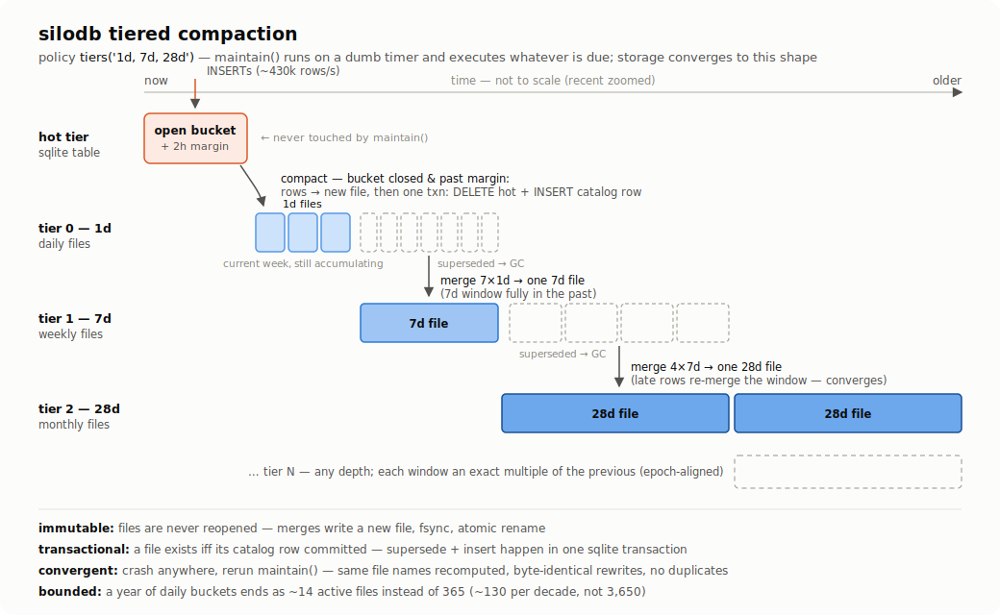

# silodb

Time-series storage for edge devices, built **on top of SQLite** (works with
libSQL): hot writes land in a normal SQLite table, closed time buckets
compact into immutable Parquet files, and both stay queryable through one
connection under **one table name**. Think TimescaleDB's
hypertable-plus-compression idea, except the compressed tier is plain
Parquet on disk — readable by DuckDB, pandas, or anything else, with zero
export step and zero vendor lock-in.

```rust
let conn = rusqlite::Connection::open("hot.db")?;
silodb::load_module(&conn)?;                       // every boot
silodb::init_table_tiered(&conn, "readings",
    "ts TIMESTAMP, device TEXT, sensor TEXT, value REAL",
    "1d,7d,28d")?;             // idempotent; cold files land in hot.db.silodb/
                               // (set_default_dir / init_table_tiered_at to choose)
silodb::set_retention(&conn, "readings", Some("2y"))?;   // its own policy, like Timescale

// the app's whole world is one name:
conn.execute("INSERT INTO readings VALUES (silodb_ts('2026-07-13T10:00:00Z'), 'boiler', 'temp', 21.5)", [])?;
conn.query_row("SELECT avg(value) FROM readings
                WHERE ts >= silodb_ts('2026-07-06') AND device = 'boiler'", [], |r| r.get::<_, f64>(0))?;

// storage management is one call on a dumb timer — dir & policy live in
// the db, never repeated at call sites:
silodb::maintain(&conn, "readings", now_epoch_micros)?;

// continuous aggregates — declare anytime, backfills from cold files,
// stays exact via compaction-transaction deltas (no avg-of-avg: sufficient
// statistics only). readings_1h = materialized history ∪ live hot tail:
silodb::create_rollup(&conn, "readings", "1h")?;
silodb::create_rollup_view(&conn, "readings", "1h")?;
conn.query_row("SELECT value_avg FROM readings_1h
                WHERE ts = silodb_bucket('1h', silodb_ts('2026-07-13T10:00:00Z'))
                AND device = 'boiler'", [], |r| r.get::<_, f64>(0))?;
```

## Or: pure SQL, TimescaleDB-style

```sql
-- plain DDL, then convert in place — existing rows survive,
-- exactly like create_hypertable(table, time_column):
CREATE TABLE readings (ts TIMESTAMP, device TEXT, sensor TEXT, value REAL);
SELECT silodb_create_table('readings');                    -- infers ts, tiers '1d',
                                                           -- files in hot.db.silodb/
SELECT silodb_create_table('readings', NULL, '1d,7d,28d');  -- or explicit tiers

INSERT INTO readings VALUES (silodb_ts('2026-07-14T10:00:00Z'), 'boiler', 'temp', 21.5);
SELECT avg(value) FROM readings WHERE ts >= silodb_ts('2026-07-07') AND device = 'boiler';
SELECT silodb_maintain('readings', unixepoch()*1000000);   -- on a timer
SELECT silodb_set_default_dir('/mnt/sd/cold/');            -- db on flash, files on SD
SELECT silodb_set_retention('readings', '2y');             -- add/change/clear anytime
SELECT silodb_add_column('readings', 'humidity REAL');     -- instant; history reads NULL
```

Or self-contained in one DDL statement (FTS5-style; the vtab owns a shadow
hot table, routes INSERTs, serves hot ∪ cold itself):

```sql
CREATE VIRTUAL TABLE readings USING silodb('cold/',
    ts        TIMESTAMP,
    device    TEXT,
    sensor    TEXT,
    value     REAL,
    tiers='1d,7d,28d'
);
DROP TABLE readings;   -- detaches the name, deletes nothing: hot rows, history,
                       -- catalog all survive; re-creating the table reattaches them
```

In every form `UPDATE`/`DELETE` on history are refused — compacted data is
immutable (retention deletes data, DDL never does). These SQL forms are
what the future loadable extension exposes to Python / Node / the
`sqlite3` CLI with zero Rust.

## How the tiers work



`maintain()` is a convergence function, not a scheduler: from (policy,
catalog, hot table, clock) it derives everything due — compacts closed
buckets, promotes daily files into weekly into monthly windows, and GCs
superseded files. Crash anywhere, run it again: same file names are
recomputed and rewritten byte-identically before the transaction that makes
them real. Full SQL the whole time — joins against your ordinary SQLite
tables included, which no TSDB query DSL gives you.

## Numbers (1 year, 1-min interval, 10 devices × 10 sensors = 52.5M rows)

Four contenders, same data, same machine: silodb; everything kept hot in
one indexed SQLite table; DuckDB querying silodb's parquet ad hoc; and
DuckDB as a self-contained engine with its own native table.

| | silodb | hot SQLite (+ts idx) | DuckDB on the parquet | DuckDB native table |
|---|---|---|---|---|
| **single writes** (1 row = 1 txn, the device reality) | **12,047 rows/s** | 11,608 rows/s | — | **214 rows/s** |
| batched ingest (rows/txn amortized) | ~430k rows/s | ~890k rows/s | — | 863 rows/s |
| bulk load (from existing bulk data) | ~540k rows/s¹ | — | — | 9.9M rows/s |
| on-disk | **133 MB** | 2,988 MB (22×) | (same files) | 140 MB |
| "1h of one sensor" | **1.0 ms** | 0.4 ms | 126 ms | 2 ms |
| "1 week of one sensor" | **59 ms** | 83 ms | 132 ms | 2 ms |
| full-year aggregate | 5.3 s | 2.8 s | 0.15 s | **15 ms** |

¹ compaction throughput (hot → parquet, background, crash-safe)

Reading it honestly, each column has a story:

- **silodb**: near-SQLite latency on the actual edge workload (selective
  time ranges), 4–5 % of its disk, hot tier permanently tiny, full ACID.
  Worst case is full-table scans (row-at-a-time vtab protocol).
- **hot SQLite**: fastest tiny lookups, but 22× the disk, growing forever,
  with a 30 s index rebuild hanging over every maintenance window.
- **DuckDB ad hoc**: reads silodb's files directly — free analytics tier,
  no export. Pays 100–250 ms per query re-planning/re-parsing footers.
- **DuckDB native**: spectacular at queries and bulk loads — and **~56×
  too slow at unbatched single writes** (the shape a device actually
  produces) to be the system of record. Single-writer, and you give up
  the SQLite ecosystem (joins against app tables, tooling, clients).

That's the architecture in one table: **SQLite where data is born, parquet
where it rests, DuckDB welcome to visit.** Methodology + full numbers:
[`crates/silodb-bench/`](crates/silodb-bench/README.md).

## Guarantees

- Hot writes have SQLite's ACID story verbatim (WAL, `synchronous=` knobs).
- Hot→cold migration is atomic: a Parquet file exists **iff** its catalog
  row committed, and the row commits in the same transaction that deletes
  the hot rows. No window where data is in zero places or two.
- Cold files are immutable — new files only, fsync + atomic rename; every
  operation is idempotent under crash-rerun (tested, byte-identical).
- Reads never require anything to exist: no files, no catalog, no
  directories — day zero works, and the vtab does zero file I/O at connect.

## Layout

```
hot.db          # SQLite: hot tables, _silodb_catalog, _silodb_policy
cold/           # one base dir for all tables
  readings/
    bucket-<start>-<end>-<seq>.parquet   # TIMESTAMP(µs, UTC) — real dates in any viewer
```

Runnable examples: [`examples/`](examples/). Canonical design doc: [`docs/spec.md`](docs/spec.md). Crate boundaries:
[`CLAUDE.md`](CLAUDE.md). Status: all spec phases built and tested (~90
tests incl. property tests, fuzzing, crash simulation, concurrency);
next planned: FTS5-style writable vtab so `CREATE VIRTUAL TABLE` is the
entire definition.
